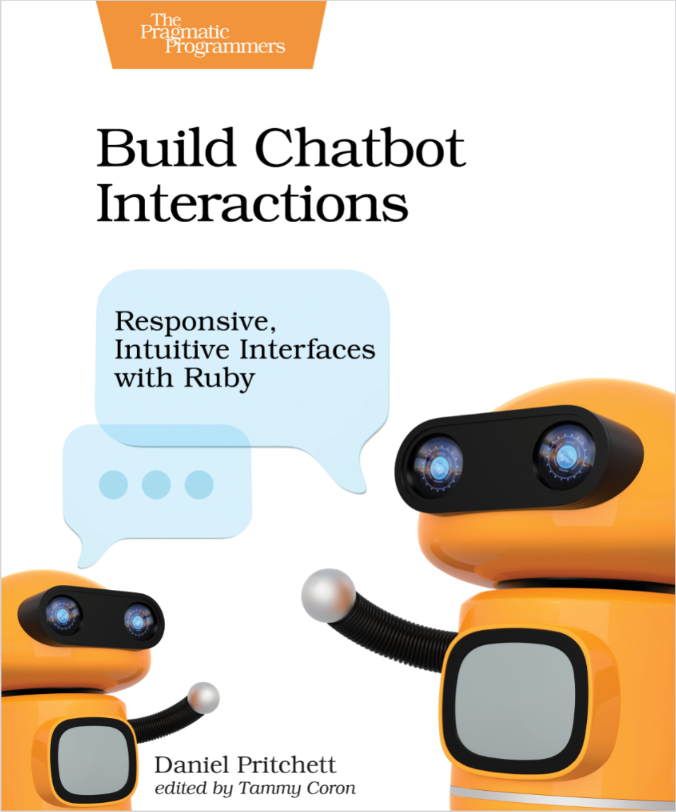

# Build Chatbot Interactions

基于《高级软件工程》课程的作业项目**Build Chatbot Interactions**所作笔记。

所用书籍为**Build Chatbot Interactions**

# Who Is This Book For?

This book is for anyone who’s interested in ideas and examples to help build useful and entertaining chatbot interactions. While all of the examples in this book are in `Ruby`, an experienced programmer can translate them into any language. 

This book is equal parts entertainment, instruction, and inspiration. If you’re not a confident programmer, don’t worry. All of the code examples are tested and executable—you can download, run, and expand on these examples later as needed.

# What’s in This Book?

This book has several sections. First, you’ll set up your own chatbot using the  Lita  framework  in  Ruby.  From  there,  you’ll  create  a  few  sample  bot interactions to get your feet wet. After that, you’ll deploy your new chatbot to the Internet so you can share it with friends. Along the way, you’ll learn how to integrate with external APIs, send messages, and perform sysadmin tasks,and how to connect to common “Internet of Things” devices.

# What You Need

You’ll need a computer that can run Ruby 2.0 or newer. You’ll also need an Internet connection so you can deploy your bots. What you won’t need, however, is lots of money—you can work through most of the examples using free tools. Several others can be pulled off with free trials and simulators from popular services. The  chatbot  skills  in  this  book  were  developed  on  a  MacBook  and  the  live production bot was published to Linux servers. The Lita framework should work pretty well for development in Windows, but you’ll have an easier time on Linux, macOS, or even the Windows Subsystem for Linux. At the time of this writing, Ruby and Lita do work on Windows, but many common Ruby 	gems won’t work out-of-the-box unless you’re on a Unix-based system.

# Why Lita and Ruby?

I selected Lita for this book, because its design and licensing make it ideal for learning, training, and sharing. The project itself is open source, so you’ll be using it freely. The  way  Lita  provides  chat  skills—which  it  calls  handlers—is  great  for readability, testability, and modularity. As you work through this book,you are going to make individual Lita skills that are publishable as well-tested, standalone Ruby gems.

# Online Resources

The code referenced in this book is available on the book’s [website](http://pragprog.com/titles/dpchat). You’re encouraged to download and run the examples, especially if you get stuck or want to see the finished product.

# 目录

### [1.第一个Lita Bot](chapters/1YourFirstLitaBot.md#1.1)
