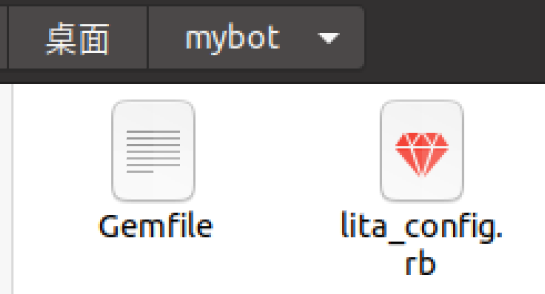

# 第一个Lite Bot

**运行环境**

一个严峻的事实: Ruby 生态系统首先瞄准了 linux，其次是 macOS，而 Windows 则排在第三。

Windows用户可以使用VMware虚拟机创建linux系统环境，Windows 10用户还有另一个选择，安装Windows Subsystem for Linux（WSL）,详见[官方文档](https://docs.microsoft.com/en-us/windows/wsl/install-win10)。

> 本书中的例子都是针对Ubuntu编写和测试的，所以如果你对使用其他的Linux发行版没有强烈的需求，最好从Ubuntu开始。

本文测试的是[VMware](https://www.vmware.com/cn/products/workstation-pro/workstation-pro-evaluation.html)版本是VMware Workstation Pro 15.1.0，[Ubuntu](https://cn.ubuntu.com/download) 版本是 Ubuntu 20.04 LTS 版本。

> 注：Ubuntu请安装英文版，否则在后续使用Lita时会出现语言包丢失的情况

[安装教程](https://www.linuxidc.com/Linux/2020-03/162547.htm)

**安装Ruby**

使用rvm来管理ruby版本

```bash
sudo apt install curl #如果没有curl的话
curl -sSL https://rvm.io/mpapis.asc | gpg --import -
curl -sSL https://rvm.io/pkuczynski.asc | gpg --import -
curl -L get.rvm.io | bash -s stable
#source ~/.bashrc 
#source ~/.bash_profile
#source ~/.profile
source ~/.rvm/scripts/rvm #开启rvm。注：每次打开新终端时执行此代码来开启rvm
rvm -v #查看rvm版本
rvm requirements #安装rvm的依赖
rvm list known #查看可下载的版本
rvm install 2.5
```

> Failed to connect to raw.githubusercontent.com port 443 **解决方法**

`sudo vi /etc/hosts` 添加如下字段

```
# GitHub Start
52.74.223.119 github.com
192.30.253.119 gist.github.com
54.169.195.247 api.github.com
185.199.111.153 assets-cdn.github.com
151.101.76.133 raw.githubusercontent.com
151.101.108.133 user-images.githubusercontent.com
151.101.76.133 gist.githubusercontent.com
151.101.76.133 cloud.githubusercontent.com
151.101.76.133 camo.githubusercontent.com
151.101.76.133 avatars0.githubusercontent.com
151.101.76.133 avatars1.githubusercontent.com
151.101.76.133 avatars2.githubusercontent.com
151.101.76.133 avatars3.githubusercontent.com
151.101.76.133 avatars4.githubusercontent.com
151.101.76.133 avatars5.githubusercontent.com
151.101.76.133 avatars6.githubusercontent.com
151.101.76.133 avatars7.githubusercontent.com
151.101.76.133 avatars8.githubusercontent.com
# GitHub End
```

**查看已安装的Ruby、gem和Bundler版本**

```bash
$ ruby -v
ruby 2.5.7p206 (2019-10-01 revision 67816) [x86_64-linux]
$ gem -v
2.7.10
$ bundle -v
Bundler version 1.16.6
```

我们需要gem和Bundler来安装Lita和它的Ruby依赖。

接下来安装非Ruby依赖项，这些依赖项为Lita使用的一些Ruby库(gems)提供了底层功能。

**安装共享库和Redis**

Ruby非常适合聊天机器人项目，因为它是一种功能强大的动态语言。这种灵活性的缺点是Ruby的速度不及其他难理解的语言。 这意味着将某些重复性任务（如crunching HTML或压缩文件）以Ruby作为编排层委派给非Ruby代码时会更好。 此代码通常以共享库的形式提供。 共享库通常以高速，静态类型的编译语言（如C）编写，并提供给其他任何本地程序（例如Lita）使用。 在本部分中，您将直接将依赖项安装到您的开发计算机上。Ruby在编译需要它们的相关gem时会使用这些库。接下来，我们运行命令行脚本来安装Lita所需的外部依赖项。

> 问：怎么知道何时需要共享库？
>
> 答：Ruby gems 在 gem 安装时使用 `extconf.rb` 管理其外部依赖项。如果你未能安装所需的 gem 并且看到消息“ extconf.rb failed” ，那么 你应该去`StackOverflow` 以及搜索可能丢失的包。例如，输入“ nokogiri osx extconf”来定位 nokogiri 缺少的包。还可以阅读 extconf.rb 文件，看看是否有什么东西跳出来。

```bash
#带注释版
sudo apt-get update && \
	# the compilers you'll need to bake in external library support
		sudo apt-get install -y build-essential && \
	# a local redis datastore to provide persistence for Lita
		sudo apt-get install -y redis-server && \
	# some of the most common external libraries needed by popular Ruby Gems
sudo apt-get install -y patch zlib1g-dev liblzma-dev libssl-dev 
```

```bash
#不带注释版，方便直接复制执行
sudo apt-get update && sudo apt-get install -y build-essential && sudo apt-get install -y redis-server && sudo apt-get install -y patch zlib1g-dev liblzma-dev libssl-dev 
```

现在已经有了构建一些常见的 Ruby gems 所需的编译器和外部依赖项，比如 Nokogiri。还安装了 Redis，这是 Lita 的主要依赖项。

**使用Redis作为Lita的“大脑”**

Redis是一个非常受欢迎的开源非关系型数据库，它提供了快速的键-值对存储功能。Lita需要Redis作为聊天交互中存储信息的一种方式。

测试Redis是否正常安装

```bash
$ redis-cli
127.0.0.1:6379> set lita "my chatbot"
OK
127.0.0.1:6379> get lita
"my chatbot"
127.0.0.1:6379> del lita
(integer) 1
127.0.0.1:6379> get lita
```

> + 默认情况下，Redis在端口6379的本地主机(127.0.0.1)上可用。
> + 使用set命令编写一个key和一个value，以便稍后检索。在上面的例子中，"my chatbot"是键 “lita”的值。
> + 使用get命令获取键上的值(如果有的话)。
> + del删除给定键的值。
> + 更多信息参考[Redis官网](https://redis.io/documentation)

**安装 Lita Gem**

环境已经搭建好，接下来就是安装Lita。

```bash
$ gem install lita -v=4.7.1
$ lita --version
4.7.1
```

**生成一个新的Lita Bot**

```bash
$ lita new mybot
      create  mybot
      create  mybot/Gemfile
      create  mybot/lita_config.rb
```

使用lita命令，可以在名为mybot的本地文件夹中创建一个新的bot。最初的Lita bot只有两个文件:`Gemfile`和`lita config.rb`。从这里开始，你可以构建出一个正常运行的聊天机器人所需要的一切。



进入新创建的`mybot`文件夹，安装Lita需要的基本依赖。

```bash
$ cd mybot
# installall Litagem dependenciesfrom./mybot/Gemfile~/mybotbundle
$ bundle
```

> + Bundler在中央rubygems.org库中搜索Gemfile中命名的每个gems。
> + Bundler解决了Gemfile中指定的各种gem 版本需求，并尝试在RubyGems 上找到一组相匹配的 gem 版本。
> + Bundler 会下载或安装所有你需要的 gems。
> + 某些低级的 gems，例如 puma，必须在后台进行一些编译，以便在前面讨论过的共享库中使用。
> + Bundler 提供 `bundle info` 命令，允许你进一步检查新安装的gem。在某种程度上，你可能还想查找 `bundle how` 和 `bundle open`。

**测试本地的Bot**

Lita已经安装，但还没有启动。要启动它，从Lita的根目录中使用`lita`命令

```bash
/mybot$ lita
Type "exit" or "quit" to end the session.
Lita > lita help
Lita: help - Lists help information for terms and command the robot will respond to.
Lita: help COMMAND - Lists help information for terms or commands that begin with COMMAND.
Lita: info - Replies with the current version of Lita.
Lita: users find SEARCH_TERM - Find a Lita user by ID, name, or mention name.
Lita > lita info
Lita 4.7.1 - https://www.lita.io/
Redis 5.0.7 - Memory used: 839.22K
Lita > exit
```

