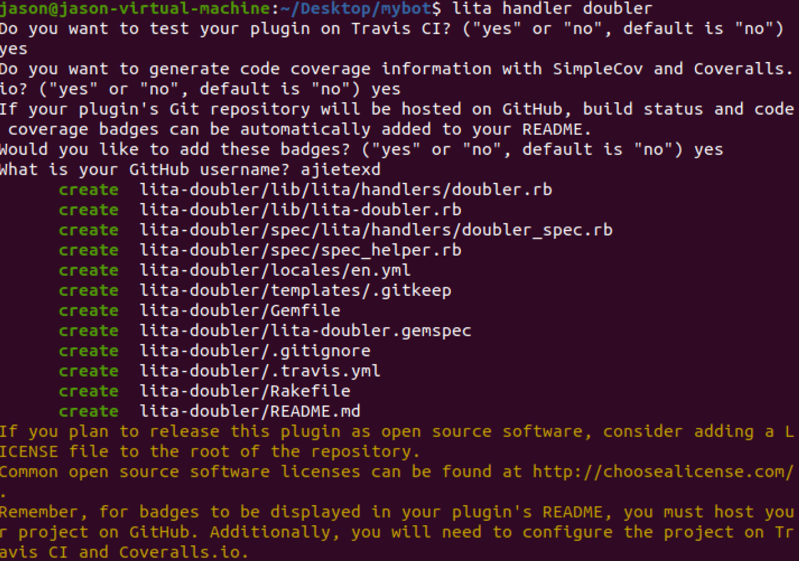
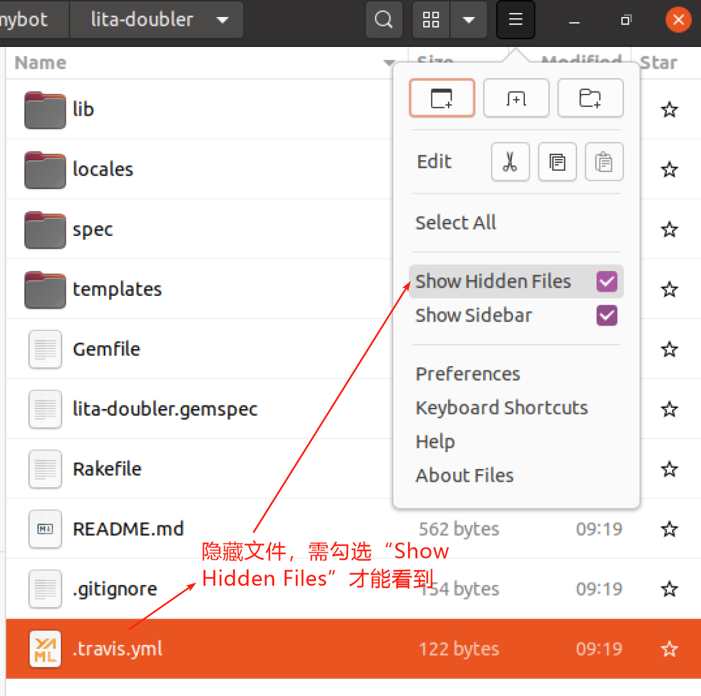

# 第一个Lita技能

在本章中，你将建立你的第一个聊天机器人技能——一个可以将给定的数字翻倍的技能。通过构建这个简单的技能，我们能够熟悉开发和发布机器人技能所涉及的相关组件和过程。

以下是要做的事情的概述:

+ 编写规则来匹配特定的用户消息
+ 为规则编写有效的代码
+ 编写RSpec测试，以确认你的技能按预期工作。
+ 设置一个发布流水线，这样你就可以将代码部署到RubyGems上
+ 在GitHub建立公共代码托管，并使用 Travis CI 进行持续的构建测试。

**生成一个空技能**

首先需要先安装`git`

1. Git安装

```bash
sudo apt-get install git
```

2. 配置git环境

```bash
git config --global user.name "你的用户名"
git config --global user.email "你的注册邮箱"
```

3. 生成SSH密钥，输入下面命令后直接回车，生成密钥的位置默认是`/home/“用户名”/.ssh/id_rsa.pub`

```bash
ssh-keygen -C "你的注册邮箱" -t rsa
```

4. 登录GitHub填入client端生成的公钥（`id_rsa.pub`中的内容）
5. 将key加入到ssh-agent，在终端输入

```bash
ssh-add  ~/.ssh/id_rsa
```

git的快速入门可以参考廖雪峰的[git教程](https://www.liaoxuefeng.com/wiki/896043488029600)

在`mybot`目录下执行如下命令，这个命令将创建一个新的 `Lita-doubler` 目录，其中包含构建第一个Lita技能所需的所有Ruby文件。

```bash
lita handler doubler
```

对于第一个技能，输入“yes”同意所有的可选提示



新生成的`Lita-doubler`目录下包含以下文件



+ `lib/lita/handlers/doubler.rb`包含你将要编写的Lita技能的核心实现代码。
+ `spec/lita/handlers/doubler_spec.rb`包含一个空的测试工具，用于自动验证新的 Lita 技能是否按预期工作。
+ `.travis.yml`是免费在线构建服务器的默认配置。稍后，在将Lita技能推送到GitHub时，将设置这个属性来自动测试 Lita 技能的每个新版本。
+ `lita-doubler.gemspec`指定你的Lita技能发布为RubyGem所需的所有重要元数据。

**完善`lita-doubler.gemspec`文件**

用适当的描述、摘要和主页链接替换“ TODO”部分。

